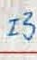

# Fintech-Final HCCR

- Handwritten Chinese Character Recognition
- T‑Brain E.Sun Bank Artificial Intelligence Challenge 2021 Summer
- This repo is revised from [Offline Handwritten Chinese Character Classifier](https://github.com/pavlo-melnyk/offline-HCCR).

## Summary
### Goal
Given the handwritten image below, recognize its corresponding Chinese character `巧`.



It is a 801-class task. There are 800 kinds of characters in total to be recognized, and one for `isnull`.

### Results
- Accuracy: 0.9054
- Top 7% (31/468)

### Notes
- Data Augmentation
    - Shift, Zoom, Rotation
    - Combine other data source
- Error Analysis
    - Find out 78 `isnull` characters that model did not do well and enhance their training data
    - Distinguish 879 (801+78) classes first, and then filter out those 78 classes characters into `isnull`
    - Raise up to 2% in valid set.


## Commands
### Train
```
time python melnyk_net.py --log_dir models_1 --training_src combine
```

### Continue Training
```
time python melnyk_net.py --log_dir models_1 --training_src combine --continue_training Trained_Model_Path
```

### Inference Single Image
```
python predictor.py --img_path images/巧_YMmNG5.jpg --model_path model_combine.hdf5
```

## Model Performance
| Model File                    | Best Valid Accuracy |    #Classes          |
| ----------------------------- | ------------------- | -------------------- |
| `model_combine.hdf5`          | 0.9058              | 801                  |
| `models_combine_similar.hdf5` | 0.9241              | 879                  |


## Hierachy
```
├───src
│   ├───melnyk_net.py
│   ├───predictor.py
│   └─── ....
├───training_data
│   ├───combine (training_src)
│   └───combine_similar (training_src)
└───models
    ├───models_1 (log_dir)
    │   ├───models_1_1.hdf5
    │   ├───models_1_2.hdf5
    │   └─── ....
    └─── ....
```

## Contact
If you have any question, please feel free to contact me by sending email to [r08946014@ntu.edu.tw](mailto:r08946014@ntu.edu.tw)